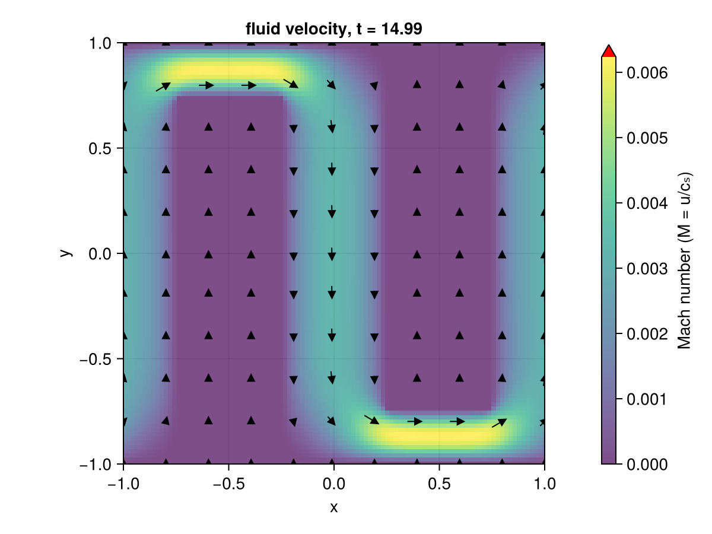
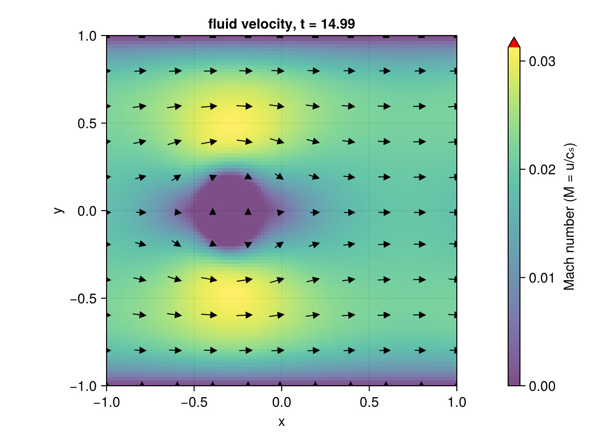
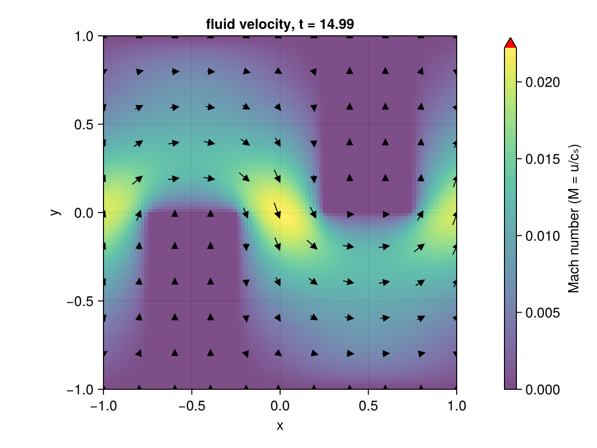
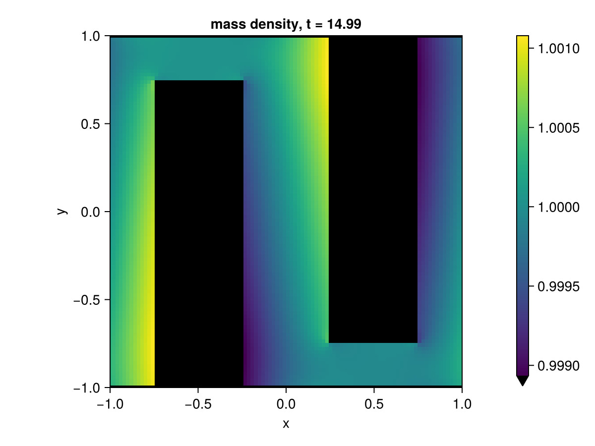
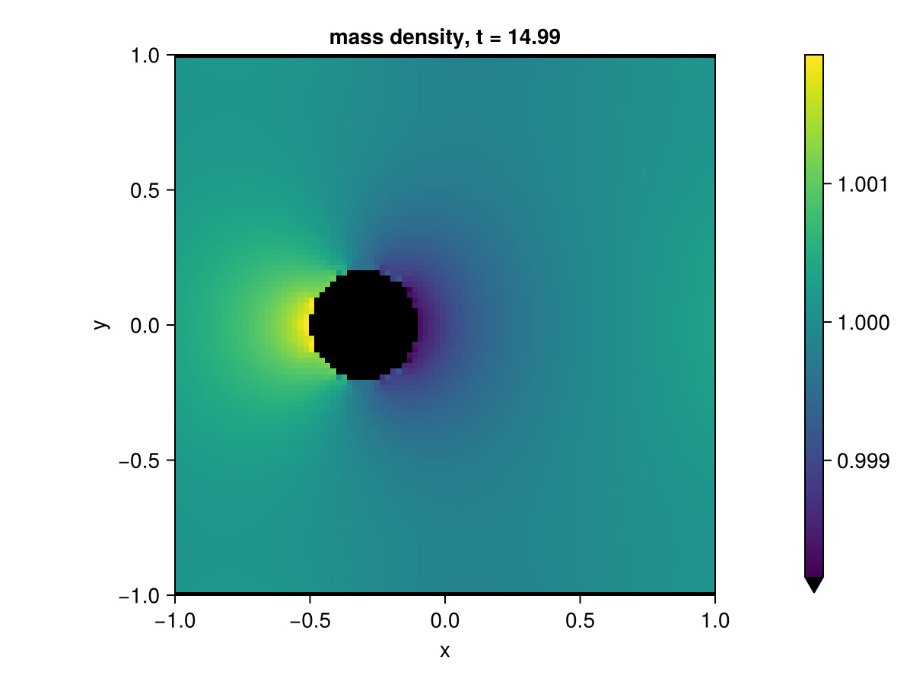
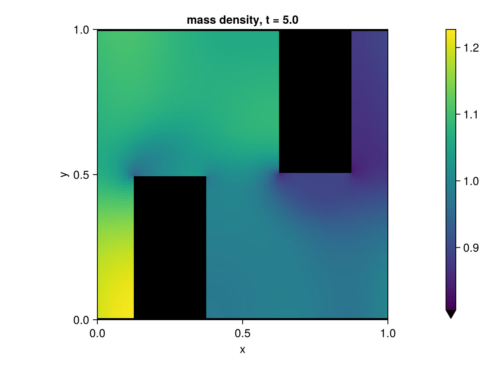

# LBMengine.jl

 <!-- https://shields.io/badges/static-badge -->

A Lattice Boltzmann Methods engine for simulation of soft flowing matter.

Some examples can be found in [LBM-experiments](https://github.com/david16correa/LBM-experiments)

|  |  |  |
|-----|------|-----|
|  |  |  |
